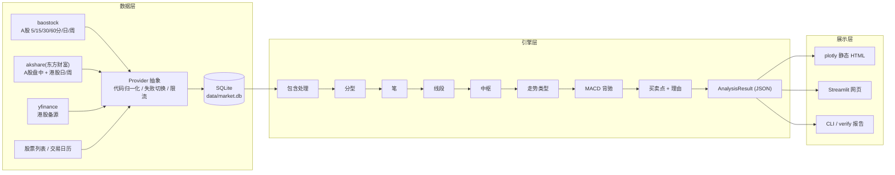

# 架构设计（v0.1）

> 设计原则：**引擎与展示解耦**（引擎只输出结构化结果）、**数据层可替换**（Provider 抽象 + 本地缓存）、**规则可配置**（阈值全部在配置文件）、**当下可重放**（任意历史时点都能复算，用于回放测试）。

## 1. 总体分层



## 2. 代码库目录结构

代码库位置建议 `~/Desktop/web/chanlun/`（不在 Obsidian 库内）。

```text
chanlun/
├── pyproject.toml              # 包定义，console_scripts: chan = chanlun.cli:app
├── README.md                   # 安装、启动、常用命令（开发文档入口）
├── config.example.yaml         # 配置模板
├── watchlist.example.yaml      # 自选股池模板
├── scripts/
│   └── 启动缠论工具.command      # Mac 双击启动器（等价 chan ui）
├── chanlun/
│   ├── cli.py                  # chan 命令：ui / plot / pool / update / import / verify
│   ├── config.py               # 配置加载与校验（pydantic）
│   ├── codes.py                # 代码归一化：600519 / sh600519 / 0700.HK → 内部格式
│   ├── data/
│   │   ├── base.py             # DataProvider 抽象接口
│   │   ├── baostock_provider.py
│   │   ├── eastmoney_provider.py   # 基于 akshare
│   │   ├── yfinance_provider.py
│   │   ├── store.py            # SQLite 读写（K 线、基础信息、更新日志）
│   │   ├── updater.py          # 增量更新、复权刷新、盘中补数
│   │   └── calendar.py         # 交易日历与级别时间对齐
│   ├── engine/
│   │   ├── models.py           # 数据类：Bar, MergedBar, Fractal, Bi, Seg, ZhongShu, BSP, AnalysisResult
│   │   ├── klines.py           # 包含处理
│   │   ├── fractal.py          # 分型
│   │   ├── bi.py               # 笔（老 / 新）
│   │   ├── seg.py              # 线段（特征序列）
│   │   ├── zs.py               # 中枢（笔中枢 / 段中枢）
│   │   ├── trend.py            # 走势类型
│   │   ├── macd.py             # MACD 与段力度
│   │   ├── divergence.py       # 背驰
│   │   ├── bsp.py              # 买卖点判定 + 判定清单
│   │   ├── analyze.py          # analyze_level() 单级别编排、as_of 重放
│   │   └── assemble.py         # assemble() 跨级别组装：投影 + 次级别验证（不回调 analyze_level 之外的级别）
│   ├── render/
│   │   ├── plotly_chart.py     # K 线 + 结构叠加
│   │   ├── html_report.py      # 单股 HTML、index.html 总览
│   │   └── explain.py          # 理由文案模板（简短 / 详细 / 教学）
│   └── ui/
│       └── app.py              # Streamlit 应用
├── tests/
│   ├── unit/                   # 每条规则的合成 K 线用例
│   ├── golden/                 # 样本股票的冻结期望输出
│   ├── replay/                 # 逐根追加的回放测试
│   └── crossval/               # chan.py 对照脚本（可选依赖，不进主包）
├── docs/                       # 开发文档（与本 Obsidian 目录内容同步）
└── data/                       # 本地缓存（.gitignore）
```

## 3. 引擎 API 与数据模型

### 3.1 唯一入口

```python
def analyze_level(code: str, level: Level, config: ChanConfig, *, as_of: datetime | None = None) -> LevelResult
def assemble(code: str, level: Level, config: ChanConfig, *, as_of: datetime | None = None) -> AnalysisResult
```

- `analyze_level`：**只用本级别 K 线**计算结构（包含处理 → … → 背驰 → 本级别可判定的买卖点），不访问任何其他级别，无循环依赖。
- `assemble`：先对目标级别、其高一级、其低一级各调用一次 `analyze_level`，再做高一级投影与二买的次级别验证，输出 `AnalysisResult`。依赖关系单向：`assemble → analyze_level`，各级别之间互不调用。

- `code`：内部统一格式（`600519.SH` / `000858.SZ` / `00700.HK`）。
- `level`：`5m | 30m | D | W`。
- `as_of`：只使用该时点之前的 K 线计算（回放测试、历史复盘）。
- 多级别联立由 `assemble` 统一完成；`LevelResult` 缓存按 `(code, level, config_hash, as_of, data_hash)` 键控，其中 `data_hash` 为该级别 K 线序列的内容哈希——最后一根时间戳相同不代表数据没变（盘中更新、复权修订都会改变历史价格）。

### 3.2 数据模型（字段以此为准，JSON 同名）

| 类型 | 关键字段 |
|---|---|
| `Bar` | `ts, open, high, low, close, volume, amount` |
| `MergedBar` | `idx, high, low, dir, raw_start, raw_end` |
| `Fractal` | `kind(top/bottom), idx, price, range_high, range_low` |
| `Bi` | `id, dir(up/down), start_fx, end_fx, high, low, merged_count, raw_count, confirmed, confirmed_at` |
| `Seg` | `id, dir, start_bi, end_bi, high, low, end_case(case1/case2/pending), confirmed, confirmed_at` |
| `ZhongShu` | `id, kind(bi/seg), zg, zd, gg, dd, elems[], enter_id, leave_id, ext_count, range_confirmed, range_confirmed_at, ended, end_confirmed, end_confirmed_at, hints[]` |
| `Divergence` | `id, kind(trend/range), seg_a, seg_c, metrics{area, dif_peak}, zero_return, grade` |
| `BSP` | `id, type(1b/2b/3b/1s/2s/3s/2b_like...), zs_kind(bi/seg), ts, price, grade(strict/suspect), confirmed, confirmed_at, refs{zs, seg, bi, div}, reason_short, checklist[{cond, status, value}], teaching, risks[]` |
| `AnalysisResult` | `meta{code, name, level, config_hash, data_updated_at, as_of}, bars, merged, fractals, bis, segs, zs_bi, zs_seg, trend, divergences, bsps, projection{level, zs[], bi_points[]}` |

所有结构对象都带 `confirmed` 与 `confirmed_at` 字段：前者决定实线 / 虚线，后者是"确认时间"（区别于端点的"发生时间"），悬停时一并显示。`grade` 表示**规则满足程度**（严格 / 疑似），不是统计置信度或胜率。

## 4. 数据层

### 4.1 Provider 抽象

```python
class DataProvider(Protocol):
    def get_klines(self, code, level, start, end, adjust="qfq") -> DataFrame
    def get_latest_intraday(self, code, level) -> DataFrame   # 仅盘中补数用
    def list_stocks(self, market) -> DataFrame                  # 代码、名称、上市日期
    def trade_calendar(self, market, start, end) -> list[date]
```

| 市场 / 用途 | 主源 | 备源 | 说明 |
|---|---|---|---|
| A 股 5 / 30 分、日、周历史 | baostock | 东方财富（akshare） | baostock 直接给前复权分钟线，收盘后当晚更新 |
| A 股盘中最新 K 线 | 东方财富（akshare） | — | 追加到缓存末尾，收盘后被 baostock 正式数据覆盖 |
| 港股日、周 | 东方财富（akshare） | yfinance | 港股分钟级本期不做 |
| 股票列表、名称 | akshare + baostock | — | 每日更新一次 |
| 交易日历 | baostock | akshare | 港股日历以数据本身为准 |

失败策略：主源异常（超时、空数据、字段变更）→ 记日志并切备源；全部失败 → 返回缓存并在结果 `meta` 标记 `stale=true`。

### 4.2 代码归一化

| 输入 | 内部格式 | baostock | akshare | yfinance |
|---|---|---|---|---|
| `600519` / `sh600519` / `600519.SH` | `600519.SH` | `sh.600519` | `600519` | — |
| `000858` / `sz000858` | `000858.SZ` | `sz.000858` | `000858` | — |
| `00700` / `0700.HK` / `700.HK` | `00700.HK` | — | `00700` | `0700.HK` |

判定规则：6 位数字按首位分沪深（6 / 9 沪，0 / 3 深，4 / 8 北交所本期不支持提示）；5 位以内数字或带 `.HK` 视为港股。

### 4.3 本地缓存（SQLite）

- 表 `klines(code, level, ts, open, high, low, close, volume, amount, source, PRIMARY KEY(code, level, ts))`
- 表 `stocks(code, name, market, list_date, updated_at)`
- 表 `update_log(code, level, last_ts, updated_at, status, message)`
- 容量估算：50 只 × 5 分钟 × 3 年 ≈ 180 万行，单文件几百 MB 以内。

### 4.4 更新策略

- `chan update`：对池内每只股票每个级别，查 `update_log.last_ts`，只拉增量。
- 日线 / 周线体量小，每次全量重拉并覆盖——同时解决前复权价格因新除权而整体变化的问题。
- 分钟线增量拉取；检测到该股新增除权事件（日线全量重拉后价格序列与缓存不一致）时触发该股分钟线全量重算。
- 盘中：`intraday_supplement=true` 时，从东方财富取当天 5 分钟 K 线并聚合出 30 分钟 / 未收盘日 K 追加到内存（不落库），页面标注"含盘中未收盘数据"。
- 默认历史深度：5 分钟 2 年、30 分钟 3 年、日线和周线全部；可配置。

## 5. 入口与页面

### 5.1 命令行

| 命令 | 作用 |
|---|---|
| `chan ui [--port 8501]` | 启动 Streamlit，自动开浏览器 |
| `chan plot 代码 [-l D] [--bi old/new] [--open]` | 生成单股静态 HTML |
| `chan pool [--levels D,30m]` | 池内批量生成 + `index.html` 总览 |
| `chan update [代码 | --all] [--levels ...]` | 拉数据入库 |
| `chan import 文件|-`（stdin 粘贴） | 批量导入代码到自选股池 |
| `chan verify 代码 [-l D]` | 与 chan.py 交叉验证并输出差异报告 |

桌面 `启动缠论工具.command` 内容即激活虚拟环境 + `chan ui`。

### 5.2 Streamlit 页面布局

```text
┌────────────────────────────────────────────────────────────────────────┐
│ 缠论工具   [输入代码/名称 ▢ 查看]        数据更新于 09-05 15:05 [更新数据] │
├──────────────┬─────────────────────────────────────────────────────────┤
│ 自选股池      │ 600519 贵州茅台      级别: [周] [日●] [30分] [5分]        │
│ ● 600519 ▲三买│                                                        │
│   000858 ▽疑似│           K线 + 笔 / 线段 / 中枢 / 买卖点 大图            │
│   00700.HK   │           高一级中枢 = 半透明色块投影                     │
│   ...        │           已确认 = 实线   未确认(可能重画) = 虚线           │
│ [+ 加入池]    ├─────────────────────────────────────────────────────────┤
│              │ 图层: ☑笔 ☑线段 ☑中枢 ☑买卖点 ☑高级别投影 ☑MACD          │
│ 参数          ├─────────────────────────────────────────────────────────┤
│ 笔: ●老笔 ○新笔│ 买卖点列表（当前级别）                                    │
│ 中枢: 段中枢   │ 08-28 三买 [严格成立] 离开中枢[1580,1620]后回抽1634未回中枢 [详情]│
│ 严格度: 默认   │ 07-15 二买 [疑似]     ... 差在：次级别未见明显背驰        [详情]│
└──────────────┴─────────────────────────────────────────────────────────┘
```

- 左侧栏：自选股池（带最新信号徽标）、搜索框、参数区（改动即重算）、更新按钮与时间。
- 主区：级别按钮（港股只显示周 / 日）、图、图层开关、买卖点列表（点击定位，"详情"侧滑面板）。
- 状态：记住上次股票与级别；URL `?code=&level=` 直达。
- 静态版（阶段 1~3）：`chan plot` 一股一个 HTML，四个级别用 plotly 按钮切换；`chan pool` 的 `index.html` 是左侧栏的静态前身。

## 6. 配置文件

```yaml
markets: [CN, HK]
levels: {CN: [5m, 30m, D, W], HK: [D, W]}
history: {5m: 2y, 30m: 3y, D: all, W: all}
data:
  providers: {CN: [baostock, eastmoney], HK: [eastmoney, yfinance]}
  db_path: data/market.db
  intraday_supplement: true
engine:
  bi: {mode: old, fx_check: strict}          # old | new
  seg: {algo: feature_seq}
  zs: {kinds: [bi, seg], bi_zs_cross_seg: false, upgrade_hint_after: 9}
  macd: {fast: 12, slow: 26, signal: 9}
  divergence: {metrics: [area, dif_peak], zero_band: null}   # 阶段 3 标定
  bsp: {types: [1, 2, 3], sub_level_check: true}
ui: {default_level: D, remember_last: true, port: 8501}
```

`watchlist.yaml` 结构见 [[项目/缠论分析工具/01-需求规格SPEC|01 SPEC]] 2.2；UI 内改动可"保存为默认"写回文件。

## 7. 测试策略

| 层次 | 内容 | 目的 |
|---|---|---|
| 单元测试 | 每条规则用手工构造的合成 K 线覆盖正反例与边界（开头包含、一字板、紧挨分型、缺口） | 规则实现正确 |
| golden 测试 | 样本集（约 10 A 股 + 5 港股）冻结期望输出（笔 / 段 / 中枢端点） | 防回归 |
| 回放测试 | 对样本逐根追加 K 线，断言已确认结构不变、只有末端可变 | 稳定性 / 不重画 |
| 交叉验证 | `tests/crossval` 调 chan.py 同配置计算，输出一致率与差异清单 | 正确性基准 |
| 性能测试 | 单股四级别出图计时 | ≤ 3 秒 |

chan.py 只装在开发环境（extra 依赖），不进运行时。

## 8. 性能预算

- 引擎：几千根 K 线纯 Python 毫秒到百毫秒级；5 分钟 2 年约 2.3 万根，仍在秒内。
- 绘图：plotly 蜡烛图数千根可接受；5 分钟级别默认只渲染最近 N 根（可配置，如 3000），结构计算仍用全量。
- 结果缓存：按 `(code, level, config_hash, as_of, data_hash)` 缓存 `LevelResult`，切换级别不重算。

## 9. 预留扩展点

- 展示层：`AnalysisResult` JSON 可直接喂给 FastAPI + KLineChart 前端。
- 调度：`updater` 可被 launchd / cron 调用实现每日自动入库。
- 数据：新增 Provider 即可接富途 OpenAPI 或付费数据（港股分钟级）。
- 级别：`assemble` 的级别关系表可替换为递归级别实现。
- 笔记：`BSP.id` 稳定，可作为复盘笔记的外键。

## 相关

- [[项目/缠论分析工具/02-缠论规则与实现口径|02 缠论规则与实现口径]]
- [[项目/缠论分析工具/04-实施路线|04 实施路线]]
